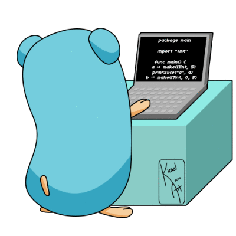

layout: true

.signature[@algogrit]

---

class: center, middle

# Understanding concurrency: a comparison C, JS, Java, Ruby, Golang

Gaurav Agarwal

---

# Agenda

* Concurrency vs Parallelism

* The UNIX way

  * Brief overview of concurrency in C

* Concurrency without threads or processes?

  * JS -> Promises

* What makes concurrency hard?

* Java vs interpreted languages like Python and Ruby

* An elegant solution to the messy problems of concurrency: Go

---

class: center, middle

Software Engineer & Product Developer

Principal Consultant & Director of Engineering

ex-Tarka Labs, ex-BrowserStack, ex-ThoughtWorks

---

class: center, middle

# 🙋‍♂️

## How many of you are new to programming in Go?

# 🙋

---

class: center, middle

# 🙋‍♂️🙋

## How many of you are familiar or have worked with concurrency?

# 🙋🙋‍♂️

---
class: center, middle

# What is concurrency?

---
class: center, middle

Concurrency is the composition of independently executing processes, while parallelism is the simultaneous execution of (possibly related) computations.

.content-credits[https://blog.golang.org/concurrency-is-not-parallelism]

---
class: center, middle

# The C way: Processes and Threads

---
class: center, middle

Coding time...

---

* `int getRandomIterCount()`

* `void busyWork(int iterCount)`

* `void say(char word[], int index)`

* `int main()`

---
class: center, middle

# 🙋‍♂️

## Is concurrency without threads and processes possible?

# 🙋

---
class: center, middle

## Absolutely! Take a look at JS...

---
class: center, middle

# What about Java?

---
class: center, middle

## NIO

.content-credits[https://docs.oracle.com/javase/7/docs/api/java/nio/package-summary.html]

---
class: center, middle

## And Ruby/Python?

---
class: center, middle

# What's the problem with Threads and Processes?

---

## Processes

* Each process has dedicated memory

* Risk of zombies

* Context switching overhead

* Requires inter-process communication

---

## Threads

* Shared memory

* Race conditions & deadlocks

* Context switching overhead

* Lower memory footprint than process, but still high (~8 MB)

---
class: center, middle

# How do you run highly concurrent apps (>10,000 concurrent tasks)?

---
class: center, middle

## Concurrency is HARD!

---
class: center, middle

Or is it?

---
class: center, middle

# Go

---
class: center, middle

---

* Comes from the CSP paper, same as Erlang

* Has lightweight user-space threads, (~8 KB)

* Go's scheduler does the heavy-lifting

---

# References

* Linux threads - [Context switching and memory overhead](https://eli.thegreenplace.net/2018/measuring-context-switching-and-memory-overheads-for-linux-threads/)

* Kavya Joshi's - [Go's scheduler talk](https://www.youtube.com/watch?v=KBZlN0izeiY)

---
class: center, middle

Code
https://github.com/AgarwalConsulting/Go-Training/tree/master/examples/11-B-concurrency/comparison

Slides
https://understanding-concurrency.slides.algogrit.com
